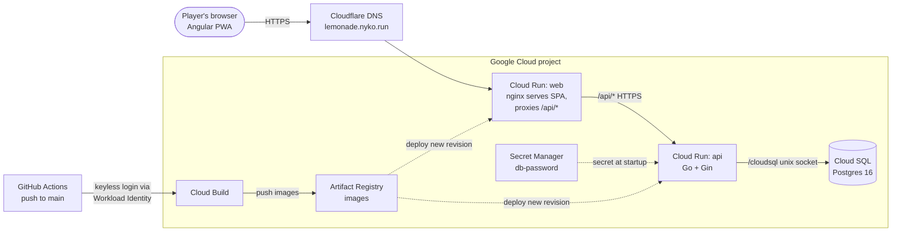
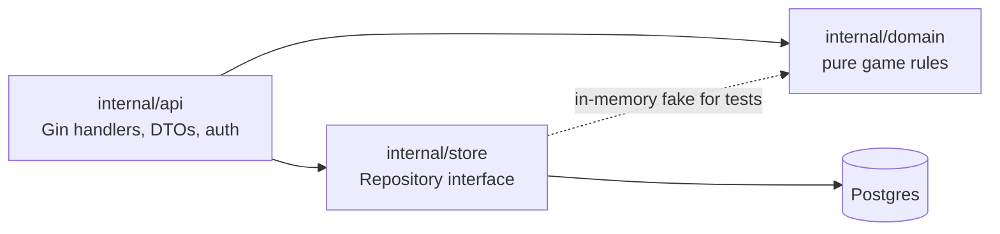

<p align="center">
  
</p>

<h1 align="center">Lemonade Tycoon</h1>

<p align="center">
  <em>Buy low, squeeze smart, sell high, and survive the market one day at a time.</em>
</p>

<p align="center">
  
  
  
  
  
</p>

<p align="center">
  
  
  
  
  
  
</p>

A turn-based lemonade business game. Buy ingredients, grow your facilities, sell lemonade, and try not to go bankrupt. Angular frontend, Gin (Go) REST API, PostgreSQL.

> **Design:** the technical design doc, [docs/numeric-tdd.md](docs/numeric-tdd.md), covers architecture, game rules, data model, API, balance and tuning, and trade-offs. Start there.

## The game in 30 seconds

1 lemon + 1 sugar + 1 ice + 1 cup = 1 lemonade. Nothing happens until you press **End day**, so take your time.

| | Step | What happens |
| :-: | ---- | ------------ |
|  | **Trade** | Prices wander every day. Buy at the ask, sell at the bid, and mind the 10% spread. |
|  | **Produce** | At end of day your production facility turns ingredients into lemonade. |
|  | **Ride the events** | Heat waves, rainy weeks, lemon blights and more push prices around for a few days. |
|  | **Grow** | Expand and upgrade warehouses and production, but every building costs daily upkeep. |
|  | **Survive** | If you cannot pay upkeep, stock is sold off to cover it. If that is not enough, the run ends. |

<p align="center">
  
  
  
  
  &nbsp;&nbsp;
  
  
  
  
</p>

The game has a built-in **How to play** menu in the top bar, with a quick start and a glossary.

## Highlights

- **Server is the source of truth.** The UI renders server state; every action returns the full game view.
- **Pure, deterministic domain.** All rules live in `internal/domain` with no I/O, and randomness is seeded, so the same seed and actions give the same game.
- **Safe concurrency.** Every action is `load, domain call, save` in one transaction with a row lock.
- **Username-only login.** A username is all it takes to play (see Known limitations).
- **Installable PWA** with an offline banner, scores board, and per-run history.
- **One-command deploy** to Google Cloud with Terraform and keyless GitHub Actions.

## Architecture



The browser only ever talks to `web`; its nginx forwards `/api/*` to `api`, so there is no CORS. Locally, Docker Compose runs the same three pieces.

Inside the API, dependencies point inward:



More detail is in [the technical design doc](docs/numeric-tdd.md#2-architecture).

## Quick start

```bash
cp .env.example .env
docker compose up -d --build
open http://localhost:4200
```

Full instructions (auth emulator, hot reload, tests) are further down.

| Service | Source | URL |
| ------- | ------ | --- |
| `web` | [lemonade-web/](lemonade-web/) (nginx) | http://localhost:4200 |
| `api` | [lemonade-api/](lemonade-api/) | http://localhost:8080 |
| `db`  | `postgres:16` | `localhost:${DB_PORT}` |

`web` forwards `/api/*` to `api` unchanged (the API serves its routes under `/api`), so no CORS setup is needed.

Working docs (in [docs/claude/](docs/claude/)): [SPEC](docs/claude/SPEC.md) (rules), [DESIGN](docs/claude/DESIGN.md) (architecture), [PLAN](docs/claude/PLAN.md) (slices), [DECISIONS](docs/claude/DECISIONS.md) (deviations and trade-offs), [ai-usage-log](docs/claude/ai-usage-log.md).

## Code structure

```
lemonade-api/    Go + Gin REST API. internal/domain holds every game rule (pure, no I/O);
                 internal/store is Postgres persistence; internal/api is thin HTTP handlers
lemonade-web/    Angular 17 SPA + PWA. Renders server state only; GameStore is the one API client
deploy/          Terraform + scripts for Google Cloud (Cloud Run, Cloud SQL)
docs/            spec, design, decisions, plan, AI usage log
docker-compose.yml   db + api + web for local use
.github/         deploy-on-push workflow
```

Each codebase has its own README with layout and commands: [lemonade-api](lemonade-api/README.md), [lemonade-web](lemonade-web/README.md), [deploy](deploy/README.md).

## Requirements

- [Docker Desktop](https://www.docker.com/products/docker-desktop/) (running), to start the full stack
- For local development and tests: [Go](https://go.dev/dl/) 1.27+ and [Node.js](https://nodejs.org/) 20+ with Chrome (for headless frontend tests)

## Install

```bash
cp .env.example .env                        # DB credentials (defaults work locally)
cd lemonade-api && go mod download && cd ..
cd lemonade-web && npm ci && cd ..
```

`.env.example` contains:

```
DB_HOST=127.0.0.1
DB_USERNAME=admin
DB_PASSWORD=password
DB_NAME=sample
DB_PORT=5432
```

## Run

### Full stack (Docker Compose)

```bash
docker compose up -d --build
open http://localhost:4200                  # the game
curl http://localhost:4200/api/health      # API health via the web proxy: {"status":"ok"}
```

```bash
docker compose down           # stop
docker compose down -v        # stop and delete the database volume
docker compose logs -f api    # tail logs (also: web, db)
```

> Postgres reads `DB_PASSWORD` only when it creates a new volume. After changing it, run `docker compose down -v` (this deletes data) or `ALTER USER`.

### Local development (hot reload)

```bash
docker compose up -d db                                  # database only
(cd lemonade-api && cp ../.env .env && go run .)         # API on :8080 (keeps running; use a new terminal for the next line)
(cd lemonade-web && npm start)                           # web on :4200, proxies /api to :8080
```

Inside Compose the API always connects to `db:5432`. `DB_HOST` only matters when you run the API outside Docker.

## Test

```bash
(cd lemonade-api && go test ./...)
(cd lemonade-web && npx ng test --watch=false --browsers=ChromeHeadless)
```

Lint and format: `gofmt -w . && go vet ./...` in `lemonade-api/`; `npm run lint && npm run format` in `lemonade-web/`.

## Deploy

Google Cloud (Cloud Run + Cloud SQL), see [deploy/](deploy/README.md). Pushes to `main` redeploy automatically.

## Achievements and leaderboards

Cosmetic achievements (42 goals across wealth, survival, production, facilities, trading and oddities, some hidden) unlock as you play and stay with your account. A toast announces each unlock, the Awards page lists them with progress, a run's page lists what it unlocked, and the global board shows each player's count. The board has two views: all-time best run, and best net worth on arriving at day 100. The achievement table is data in [lemonade-api/internal/domain/content/achievements.go](lemonade-api/internal/domain/content/achievements.go), with typed checks evaluated in `internal/domain/achievements.go`. On first start the API grants what already-finished runs prove (see the design doc, section 4).

## Tuning the game

All balance numbers (prices, volatility, events, facility costs and upkeep) are one struct: `DefaultConfig()` in [lemonade-api/internal/domain/config.go](lemonade-api/internal/domain/config.go). Change a value and restart the API (`docker compose up -d --build api`); the frontend needs no changes. The values, what each knob does and the balance analysis are in the [technical design doc, section 9](docs/numeric-tdd.md#9-balance-and-tuning).

```bash
cd lemonade-api
go test ./internal/domain                                            # balance guard-rail tests
BALANCE_REPORT=1 go test ./internal/domain -run TestBalanceReport -v # full report
```

The commodities and recipes are data tables in [lemonade-api/internal/domain/content/](lemonade-api/internal/domain/content/) (`commodities.go`, `recipes.go`), each with a validation test. A commodity's base price there seeds `Config.BasePrice`, which stays the tuning knob. Keep the first five commodities in their order: timelines saved before the catalog store stock as arrays in that order.

Upgrades are rows in `content/upgrades.go` (key, name, category, cost, daily upkeep, requirements, typed effects, a plain-words description); a new upgrade that uses an existing effect kind is one row, and a new effect kind needs a hook in `effects.go` plus a test. Numbers to tune: cost and upkeep per row, and the effect values (yield percent, ice kept, depth bonus, discounts). The balance report prints an "upgrader" bot (the careful grower plus upgrades that pay back within 20 days) against the plain grower; a sweep test checks that no single upgrade shortens "everything maxed" by more than 10 days. `TestGoldenBotRuns` stays byte-identical because the existing bots never buy upgrades; do not re-record it.

Changing a price, cost or upkeep also changes a few exact numbers asserted in the API and domain tests (for example the $775 first warehouse upgrade); update those alongside.

## Known limitations

- Login is username-only (sent as an `X-Username` header), by design of the brief. Not secure: anyone can play as anyone by typing their name. Usernames are 3 to 40 ASCII characters and not case sensitive (`Joe` and `joe` are the same player).
- Usernames are public on the global high score board, and because login is username-only, anyone can type another player's name and play (or read their run history) as them. A player's run detail is readable only with their username; other players' runs are not viewable from the board.
