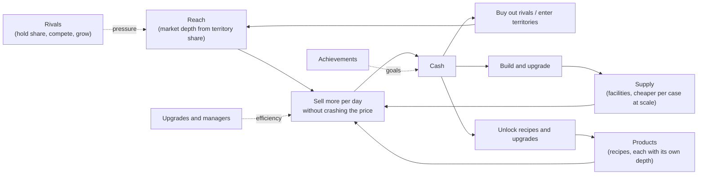

# Late game and scaling: design doc (draft 1, for review)

**Status:** draft for the user to review and refine. Nothing here is decided or built. Numbers are placeholders to be tuned by simulation. Content catalogs (territories, rivals, upgrades, commodities, recipes, events, achievements, managers) are in `LATE-GAME-CONTENT.md`. Open questions are in section 11.

**Written against:** branch `feature/slices-9-13` after balance pass 1 (market depth, decisions 31 to 33) and Sign in with Google (decision 34). Difficulty and the rival were cut earlier (decision 30), and the score is final net worth (decision 27).

## 0. Decisions so far (user, 2026-09-24)

| Question | Decision |
|---|---|
| 1. Endless or victory | **Victory condition** ("Global leader") with the option to keep playing, recorded as a win |
| 2. Target run length | **150 to 200 days** for a diligent player to finish |
| 3. Benchmark | Diligent bot for targets, careful grower as the control that must still grow (open question 3, recommendation accepted with 1 and 2) |
| 5. Rivals move share and run price wars | **Confirmed.** Supersedes "rival race only" and "no shared-market rival pressure" |
| 4. Phase 0 first | **Yes.** Handoff: `HANDOFF-LATE-GAME-PHASE0.md` |
| 14. Perishable fresh fruit and herbs | **Yes** (new fresh inputs only; lemons keep) |
| 15. Pooled storage by class | **Yes** |

All other open questions in section 11 are still open.

---

## 1. Summary

Today a careful player flattens out at about **$15k**. That is not a tuning miss: under the current rules the market can only absorb about **54 cases a day**. That is half of a fully built Kitchen tier. **Every facility upgrade after that makes the player poorer.** A bigger factory adds upkeep without adding demand, and bigger tiers are also more expensive per case. So the late game has nothing to spend on that pays back.

The fix is to make **demand** the thing a player grows, and to build the late game around growing it:

- **Territories** (Neighborhood, then City, Region, Nation and World) add market depth, so a bigger business has somewhere to sell.
- **Rival stands** hold the share of each territory the player does not own. The player takes share by **buying rivals out** or out-competing them. Rivals are the goals of each era, and they keep the late game from being a solved routine.
- **Economies of scale.** Bigger tiers become *cheaper* per case, new top tiers unlock by era, and supplier depth grows with the player.
- **Upgrades** are one-time purchases for quality of life and gameplay, like a freezer that keeps ice for a day, event insurance, forecasts, or automation.
- **New commodities and recipes**, like strawberry lemonade, limeade, Arnold Palmer, sparkling bottled lemonade, and lemon bars. Each product has its own market depth, so diversifying is another way to grow.
- **Achievements** give goals on every timescale.
- **Managers and fast-forward** keep a 20-product, five-territory business playable without hundreds of clicks a day.

Pacing target: a diligent (not expert) player keeps growing through five eras. Net worth rises by about 5 to 10 times per era, and each era takes longer than the one before. The first slice is a small balance change (phase 0) that removes the $15k ceiling on its own, before any new system ships.

---

## 2. The problem, measured

### 2.1 What the bots show today

`BALANCE_REPORT=1 go test ./internal/domain -run TestBalanceReport -v`, 200 seeds, current `DefaultConfig()` (free depth 80, slope 0.3%, recovery 50%, cap 60%):

| Bot | Bankrupt | Day 30 | Day 45 | Day 60 | Day 90 | Milestones |
|---|---|---|---|---|---|---|
| Careful grower | 21% | $3.8k | $10.2k | $10.5k | $14.6k | L1 full day 34, first upgrade day 62, **never L3, never maxed** |
| Thresholder | 20% | $3.1k | $9.1k | $9.1k | $16.8k | |
| Opportunist | 22% | $3.0k | $10.0k | $8.8k | $15.6k | |
| Spammer | 100% | | | | dead | the exploit is closed |

From day 45 to day 90 the careful player gains about $100 a day. One player in five still goes bankrupt, mostly by buying capacity that cannot pay for itself.

### 2.2 Why: a steady-state model of market depth

With recovery 0.5, a player selling `q` cases every day starts each day with a remembered pressure of `q`. That means case `k` of the day sits at pressure `q + k`, so the effective free depth is about half of `FreeDepth`. Pricing each case against the current rules at base prices (lemonade bid $81, input asks $22 + $11 + $11 + $11):

| Production level (10 buildings) | Capacity/day | Best volume/day | Gross profit/day | Upkeep needed | Net/day |
|---|---|---|---|---|---|
| L1 Kitchen | 100 | 54 | $1,167 | $180 | **$987** |
| L2 Food Truck | 200 | 54 | $1,167 | $240 | $927 |
| L3 Bottling Plant | 400 | 54 | $1,167 | $400 | $767 |
| L4 Factory | 800 | 55 | $1,167 | $480 | $687 |

A fully maxed business pays **$4,800 a day in upkeep** against a **$1,167 gross ceiling**, so it goes bankrupt by construction. The model script is in the planning session's scratchpad; the balance agent should recreate it as a test helper.

### 2.3 Tiers have diseconomies of scale

| Tier | Build cost per case of capacity | Upkeep per case per day |
|---|---|---|
| Kitchen | $50 | $2.00 |
| Food Truck | $75 | $2.50 |
| Bottling Plant | $100 | $3.00 |
| Lemonade Factory | $125 | $3.50 |

Warehouses follow the same pattern: $0.20 to $0.50 upkeep per case. Upgrading only buys room under the 10-building cap, and it makes every case cost more. Real businesses get cheaper per unit as they grow, and players expect that.

### 2.4 So the root causes are

1. **Demand is fixed.** Nothing the player does grows the market.
2. **Supply gets worse with scale.** Each tier costs more per case.
3. **Nothing else to do with cash.** The only sinks are facilities, and past L1 they are traps.

Any new content has to fix (1) and (2), or it will hit the same ceiling.

---

## 3. Goals and principles

**Goals**
1. **A diligent player keeps growing.** The careful-grower bot, and a new "diligent" bot that uses the new systems sensibly, never flatten for more than about 15 days until the last era.
2. **Not excessively hard.** Careful play has a bankruptcy rate at or below today's, and no new system can bankrupt a player who ignores it.
3. **Every era opens headroom.** Each era has a visible goal, a new tool, and a bigger market, and takes longer than the previous era.
4. **Depth without clutter.** Complexity arrives gradually (one era at a time) and automation arrives before the click count becomes a chore.
5. **Skill still matters.** Timing, event play and allocation beat blind play, but blind play is not punished to death.

**Principles to keep (from the existing design and decisions)**
- The server is the source of truth, and the frontend renders the game view and computes no outcomes.
- The domain stays pure and deterministic. All randomness comes from `seed ^ day` with a salt per system.
- Content is **table-driven** like `Config.Events`, so adding a rival, recipe, upgrade or achievement is one row plus a validation test.
- **No inventory-destroying random events.** Price, demand and share effects are fine.
- The spammer exploit stays closed, so price impact remains. Its depth grows with the player's reach, not with raw capacity.
- Old saves keep loading. An in-progress game becomes era 1 with exactly today's numbers.
- Mobile first, one primary button per screen, sentence case, and whole dollars (with compact formatting like `$1.2M` at large values).

**Non-goals for this epic:** real-time play, multiplayer or shared markets between players, real-money anything, and a player-set lemonade price with a demand curve (the market still sets prices).

---

## 4. The new core loop

Growth needs **demand and supply together**. A player who overbuilds sees idle capacity, and a player who under-builds leaves depth unsold. The UI shows both (see section 9) so the next move is always readable.

---

## 5. Progression: five eras

Eras are defined by the largest territory the player has entered. Targets are for the **diligent bot**. The careful-grower bot should reach each milestone within about 1.5 times the day shown.

| Era | Territory | Lemonade demand depth | What unlocks | Diligent player reaches it | Net worth there | Typical business |
|---|---|---|---|---|---|---|
| 1 | Neighborhood | 200 (start at 40% share = 80, today's number) | Tiers 1 and 2, first upgrades, first recipe (limeade) | day 1 | $1k to $10k | a few kitchens |
| 2 | City | 800 | Tier 3, +10 building cap, era 2 recipes, managers | ~day 30 to 40 | ~$40k | food trucks, first bottling plant |
| 3 | Region | 3,000 | Tier 4, bottled products, supplier contracts | ~day 65 to 80 | ~$300k | factories, 2 to 4 products |
| 4 | Nation | 12,000 | Tier 5 (Regional Plant), premium recipes, fast-forward | ~day 100 to 120 | ~$2.5M | 6+ products, automated |
| 5 | World | 50,000 | Tiers 6 and 7, global rivals, victory condition | ~day 150 to 180 | $20M+ | an empire |

With the price-impact shape made relative to depth (section 6.1), the same model gives: era 1 about $1.2k to $2.9k gross a day, City about $11.7k, Region about $44k, Nation about $175k and World about $730k (lemonade only, full share, base prices). Real play has partial share, upkeep, entry costs and buyouts, which is what stretches it over 150+ days.

---

## 6. Systems

### 6.1 Scale economics (phase 0, fixes the plateau)

1. **Flip the tier curve** so each tier is cheaper per case. Suggested production tiers (per building): Kitchen 10/day, $500, upkeep $20 ($2.00/case); Food Truck 25/day, $1,100, $40 ($1.60); Bottling Plant 60/day, $2,200, $75 ($1.25); Lemonade Factory 150/day, $4,500, $150 ($1.00). Warehouses follow the same shape. Upgrading then saves money per case as well as adding room, which is what players expect.
2. **Make impact relative to depth.** Today `ImpactSlope` is a fixed 0.3% per case past free depth, so bigger markets would still crash after the same number of excess cases. Define it as a percentage per share of depth instead: `impact = min(cap, ImpactShape x excess / depth)`, with `ImpactShape` 0.24 matching today's behaviour at depth 80. The feel is then the same at every scale. The spammer still loses, because it still dumps 2 to 3 times its depth.
3. **Interim depth until territories ship.** Tie free depth to the warehouse level (the pass 2 option a: 80 / 160 / 320 / 640). This is a small change that lets the balance agent unblock the diligent player now. Territories then replace it (depth comes from reach, and warehouse level stops mattering for depth). The two changes use the same `FreeDepth` code path, so this is not wasted work.
4. **Input supply depth grows too.** Buying 600 lemons a day should not crash the ask at City scale. Input depth equals the player's reach times a per-input ratio, and supplier contracts (upgrades) add to it.

Phase 0 is **balance only**: no new UI beyond numbers, no schema change except a per-level depth table, and no content. Its success test: the careful grower passes $15k by day 60, reaches L3, and at least half of careful growers max out within 120 days, with the spammer still failing. (The diligent bot does not exist until the new systems do.)

### 6.2 Territories and market reach

- **Territories** are a fixed ladder (the table in section 5). Each has a lemonade demand depth, a demand depth per product (section 6.5), an entry cost, and a daily hub upkeep (a distribution hub). Owning more territories reduces hub upkeep by a synergy discount.
- **Share.** In each territory the player holds a share `s` between 0 and 100%. Rivals hold the rest. On entry the player gets a starting share (10% for City, 8% Region, 5% Nation, 3% World). The Neighborhood starts at 40%, which reproduces today's 80 free cases exactly, so old saves are unchanged.
- **Reach** (the free depth for a product) is `sum over territories of demand(product, t) x s(t) x brand multiplier`. The market panel shows reach as "Market depth 1,240 cases" with a breakdown by territory.
- **Prices stay global** (one price per commodity, as today). Territories are depth, not separate price books. This keeps the market panel to one row per commodity. A per-territory price and shipping model is a possible later mode (open question 10).
- **Facilities stay one global pool**, with a building cap of 10 per type per territory owned and tiers unlocked by era. Building a plant per city is a lot of UI for little gameplay (open question 11).
- **Entering** a territory is an action (`POST /api/game/territories/:key/enter`) that needs cash and the previous territory (you cannot enter the World from the Neighborhood).

### 6.3 Rival stands (adversaries)

**Idea:** a pool of about 20 named rival businesses runs alongside the player. Each belongs to one territory and one scale tier, from a kid's stand next door to global megacorps. They hold the share you don't have. You grow by taking share from them, and they fight back.

**Rival state.** Rivals are **stat blocks, not full simulated games**. This keeps the cost at about 20 small updates a day, it is deterministic, and it is easy to balance. The current `Game` machinery would be far too heavy to run 20 times per end-of-day.
- `RivalDef` (content): key, name, territory, tier, starting share, personality, growth rate, buyout multiplier, and flags for special rules.
- `RivalState` (on `Game`): share, valuation, momentum (a small number that biases daily share moves), status (active, acquired or folded), and days since its last event.

**Personalities** make rivals feel different. They are data, not code branches:
- **Passive:** grows slowly and never attacks. A cheap early buyout.
- **Aggressive:** starts price wars and campaigns against the leader. Its share swings.
- **Premium:** holds share stubbornly, has an expensive buyout, and does not start price wars.
- **Opportunist:** attacks when the player is weak (low fill rate, or a negative event active), and offers merger deals when it is itself weak.
- **Integrated** (regional and up): owns farms, so its moves affect input depth, not lemonade.

**Daily tick** (in `EndDay`, after the market tick, with its own salt):
1. Valuation updates. It is roughly `share x territory demand x margin x multiple`, plus momentum.
2. The share contest runs. Each territory compares the player's **presence** (brand upgrades, active marketing, fill rate, meaning how much of their depth they actually sold, and a small price-competitiveness term) with each rival's strength. Shares move toward the stronger side by at most `MaxShareShiftPerDay`, for example 1 point. The player's share never drops below a floor (for example half of their entry share, and never below 40% of the Neighborhood).
3. Rival events can fire, for example a price war, a rival expansion, a merger offer or a rival folding (catalog in the content doc).

**Player actions against rivals:**
- **Buy out** (`POST /api/game/rivals/:key/buyout`): pay `valuation x premium` (friendly 1.2, hostile 1.6 if the rival's mood is hostile). You get its share, and a few of its buildings at a discount (economies of scale through acquisition). Rivals grow over time, so buying earlier is cheaper but ties up cash, which is a real decision.
- **Marketing campaign:** spend to add a temporary presence bonus in one territory for N days. It is a cash sink that defends or grows share without a buyout.
- **Ignore:** always allowed. A player who never interacts with rivals still keeps their share floor and grows more slowly. Ignoring rivals never causes bankruptcy.

**Answering "how does this affect progression and the player":**
- **For progression, rivals are the dials.** Territory depth sets the ceiling of each era, rival shares set how much of it the player starts with, and buyout prices set how long it takes to claim. Balance can tune pacing per era without touching the market maths.
- **For the player, rivals give each era a goal** ("own the City") and a story (the kid stand next door becomes a global conglomerate). They add a new decision: buy now, buy later, or fight with marketing. They also add mild pressure that keeps the late game from being a solved routine, without the bankruptcy spiral a harsher rival would cause.
- **Risks and mitigations:**
  - *Rivals feel unfair:* moves are capped and telegraphed a day ahead in the rival card ("Zest Express is planning a campaign"), and every change has a readable reason.
  - *Too passive:* personality mix per territory.
  - *Too complex:* rivals are introduced one territory at a time, and the rival card shows at most the current territory by default.
- **Supersedes two earlier decisions:** "rival is race only, never moves your prices" (decision 30 cut it) and "no shared-market rival pressure" (balance handoff section 4). Rivals now move the player's **share** (depth). Price wars move the lemonade price through ordinary events, never the underlying walk. This needs explicit confirmation (open question 5).

### 6.4 Upgrades

One-time purchases (some with levels, and some with small upkeep) that change a rule instead of just adding capacity. They are defined as data: `UpgradeDef{key, name, category, cost, upkeep, requires (era, facility tier, other upgrades), effects []Effect}`.

Effects are a small **closed set of typed modifiers** that the domain reads at fixed hook points. There is no scripting. For example: `IceKeepCases` (the freezer), `EventDamp{event, factor}`, `ForecastDays`, `DepthBonusPct{product}`, `InputDepthBonusPct{resource}`, `InputDiscountPct`, `UpkeepDiscountPct{facility}`, `YieldBonus{recipe}`, `PresenceBonus`, `Manager{kind}`, `Byproduct{recipe}`, `QoL{feature}`. Each effect type has one hook and one test, so a new upgrade is one catalog row.

Categories (the full list of about 40 is in the content doc): freshness and storage (freezer, cold room), production (juicer, automation line), market and brand (sign, billboard, TV spot, loyalty app), intelligence (weather radio, almanac, market analyst), event resilience (awnings, generator, insurance), logistics and supply (supplier contracts, lemon orchard lease), finance (accountant, credit line), and automation and QoL (managers, order book, fast-forward).

**The freezer as a worked example.** Ice now melts to 0 at the end of the day. A freezer with capacity `F` keeps up to `F` cases of ice for one extra night. This needs ice tracked as **two age buckets** (fresh, and one night old), with production using the oldest first. Levels raise `F`. Cost basis follows the same rule. The day report gains "Ice kept in freezer".

Previously struck: "sell-price upgrade items" were removed from the P1 list (item 8). Upgrades return here as a broader system. Following the user's earlier rule that only building quantity can be sold, **upgrades cannot be sold** (open question 12).

### 6.5 Commodities and recipes

**Data-driven resources.** `Resource` is a fixed 5-value enum today. The timeline stores stock as `[5]int`, the price log stores prices as `[5]int`, and the TypeScript `Resource` is a union of five strings. This epic turns commodities into catalog data (key, name, category, base price, storage class, shelf life, icon, colour), with the market, inventory and cost basis keyed by commodity. The fixed arrays become maps or ordered slices. Old saves map their five-slot arrays onto the first five keys. This refactor is its own slice (phase 4) and ships with **no new content**, so any regression is easy to see.

**Recipes.** `Recipe{key, name, output, outputQty, inputs map[commodity]qty, requires (era, facility tier, upgrade), facility (production, bottling line, freezer, oven)}`. Production capacity is shared. The player sets a **production plan**, which is an ordered list of recipes with target amounts (or "as much as possible"). `produce()` fills it in order, limited by inputs, space and capacity, and the header projection (P0-3) previews it.

**Each product has its own market** (price walk, bid and ask, depth per territory). Diversifying is therefore a real way to grow: a second product doubles total depth without crashing lemonade.

**Interactions that give recipes a point:**
- **Substitutes:** honey can replace sugar in some recipes, so a sugar spike has an answer.
- **Hedges:** lemon bars and hot honey-lemon tea are not hurt by Rainy Week or cold weather (they sell *better*), so a diversified business is steadier.
- **Complements:** products that share a limited input (lemons) compete for it, which forces trade-offs.
- **Premium and thin:** lavender lemonade sells for $220 but has a tiny market, so it is a small side line, not a main one.
- **Byproducts:** a zester upgrade turns spent lemon peel into candied peel to sell. It is free extra revenue that grows with scale, a direct economy of scale.
- **Facility gating:** bottled products need the Bottling Plant tier or higher, frozen products need a freezer, and bakery items need an oven. This ties recipes to the facility ladder.

**Storage:** twenty separate per-commodity warehouses would be tedious. The recommendation is **pooled storage by class**: dry goods, cold (fruit and herbs), frozen (ice), and finished goods. The existing five warehouses map onto this: lemon to cold, sugar and cup to dry, ice to frozen, lemonade to finished. This changes the warehouse UI and rules, so it needs a decision (open question 15).

**Perishability:** ice keeps its current rule. Fresh fruit and herbs are proposed to keep 3 days, and cold storage upgrades extend that. Finished goods never spoil. (Open question 14: earlier "no perishable lemonade" was a balance decision about the finished product.)

**Launch set:** about 6 new commodities and 5 recipes in the first content slice, then roughly 20 commodities and 14 products by World era (catalog in the content doc). The UI needs category filters once there are more than about 8 rows (section 9).

### 6.6 Managers and fast-forward (automation QoL)

Once a player runs several products across several territories, manual trading is a chore. **Managers** are upgrades with a small upkeep. Each runs one rule the player configures, during end-of-day, in a fixed and deterministic order:
- **Purchasing manager:** buys inputs for tomorrow's production plan, but only up to a maximum ask the player sets (for example "at most 110% of base").
- **Sales manager:** sells finished goods down to a floor price, and never beyond free depth unless allowed.
- **Plant manager:** keeps the production plan filled, and skips a recipe whose margin is negative today.
- **Logistics coordinator:** keeps a stock buffer and handles freezer rotation.
- **CFO:** keeps a cash reserve of N days of upkeep before any spend.

**Fast-forward** (Nation era) runs up to N days with managers in charge. It stops early on any event, rival move, bankruptcy risk, or a threshold the player set. Each day still produces a report. This is the main late-game quality-of-life feature and it keeps the late game about decisions, not clicks.

Managers reuse the bots' decision helpers (`profitableBatch`, `capacityBinds`), which keeps them honest and makes the diligent bot "a player with all managers hired".

### 6.7 Achievements

Server-evaluated after every mutation from the game, its stats and the run history. They are stored per account (`achievements` table: user, key, unlocked_at, run_id) and are never lost across runs. Definitions are data: `AchievementDef{key, name, description, category, tier (bronze, silver or gold), hidden, check}`, where `check` is one of a small set of typed predicates (for example `NetWorthAtLeast(n)`, `StatAtLeast(stat, n)`, `EventSurvivedWithProfit(event)`, `RivalsBoughtOut(n)`, `OwnsAllUpgrades(category)`). The full list of about 70 is in the content doc.

UI: a toast on unlock (no emoji, one line), an `/achievements` page with progress bars and hidden entries shown as "???", and a badge count on the profile and leaderboard row. The recommendation is **cosmetic only**. Rewards would distort the leaderboard (open question 19).

### 6.8 Other ways to keep scaling (menu, ranked)

| Idea | What it adds | Recommendation |
|---|---|---|
| **Victory condition** ("Global leader": own at least 50% of World share, or buy out the last megacorp) | A real ending and a win screen. The player can keep playing afterwards. | **Yes** (phase 7) |
| **Economic cycles** (boom and recession regimes lasting 10 to 30 days that shift all demand ±15%) | Macro strategy for the late game: expand in a boom, save in a recession | **Yes**, cheap (it is an event with a long duration) |
| **Contracts and orders** ("Stadium wants 2,000 cases of lemonade by day 45 at $105") | Planning goals, and a premium over market price | **Yes** (mid-epic) |
| **Seasons** (a 60-day year with a summer peak and a winter trough) | Rhythm and counter-cyclical products | Maybe. It pairs well with hedges, but it lengthens runs |
| **Loans and credit line** | Leverage to accelerate, plus interest risk | Maybe. It interacts with bankruptcy rules |
| **Franchise and prestige** (sell the company and earn legacy perks for the next run) | Replay value | Later. It breaks leaderboard comparability unless boards are separate |
| **Time-capped leaderboards** ("best net worth at day 100") | Fair competition in an endless game | **Yes** (open question 23) |
| **IPO and shares** | Very late-game fantasy | No, too much for the payoff |

---

## 7. Balance approach

- **Bots stay the method.** Add a **diligent bot** that uses the new systems sensibly: it enters territories at a payback rule, buys the cheapest rival per share point, keeps supply about equal to reach, buys the freezer and forecasts, adds recipes when capacity is idle, and hires managers once available. Keep the careful grower as the "does not use new systems" control. It must still grow (more slowly), which proves that ignoring new systems is not punished.
- **Guard rails per era:** time to reach each era (the targets in section 5, with bands), bankruptcy rates (careful at or below today, diligent at 10% or less), the spammer still failing, no bot flat for more than 15 days before era 5, and the share of net worth in unsold stock staying bounded (score padding, decision 32).
- **Invariants:** buyouts never return more than they cost within N days at base prices (no instant flips), entering a territory never profits on the first day, a rival's share plus the player's share equals 100% per territory, and all systems are deterministic.
- **Knobs** (all in `Config`, documented in README "Tuning the game"): territory depths, entry costs, hub upkeep, starting shares, rival growth and valuation multiple, the buyout premium, maximum share shift per day, `ImpactShape`, tier tables, upgrade costs, and recipe prices.
- **Long runs change the tests.** The harness goes to day 200. Reports print net worth on a log scale, and sweeps run in parallel.

---

## 8. Architecture and data impact

| Area | Change | Risk |
|---|---|---|
| `domain.Resource` | Becomes catalog data. `Resources`, `Inputs`, `Valid()`, `[5]int` in `timeline.go` and `pricelog.go` become catalog-driven. The TS `Resource` union becomes `string`, and the catalog is sent in the view (or a static `/api/catalog`). | **High**: touches most files. Its own slice with no new content. |
| `Config` | New tables: territories, rivals, recipes, upgrades, achievements, managers, and tier tables extended to 7. Consider moving content to `internal/domain/content/*.go`, with one validation test per table (unique keys, references resolve, numbers sane). | Medium |
| `Game` state | New JSONB fields: territory shares, rival states, owned upgrades, production plan, manager settings, ice age buckets, active campaigns and contracts. Each is loaded with safe defaults (an old save becomes era 1, Neighborhood at 40%, no rivals acquired, no upgrades). | Medium. Use the round-trip Postgres test with an old-shape row, as before. |
| `EndDay` | Order becomes: managers act, produce by plan, freezer rotation, melt, upkeep (facilities, hubs, managers, upgrades), record, bankruptcy check, advance, market tick (all commodities), events, rivals tick, achievements check. Each step is a named function with its own tests. | Medium |
| New tables | `achievements (user_id, key, run_id, unlocked_at)`. Leaderboard variants may need `runs.net_worth_day100`. | Low |
| API | New endpoints: territories enter, rivals buyout, marketing campaign, upgrades buy, production plan set, manager settings, fast-forward, achievements list. The game view grows, so split heavy parts into lazy endpoints (`/api/game/market`, `/api/game/rivals`) or trim ladders to visible rows. | Medium: the view is already 13 to 50 KB with the whole timeline |
| Timeline | The 400-point cap and 7-day detail were fine for about 90-day games. For 200+ days, downsample to one point per day beyond 30 days, and keep events and milestones. | Low |
| Money | Big numbers. `formatMoney` gets a compact mode (`$1.2M`, `$34.5B`). Whole dollars stay integers (Go `int` is 64-bit, fine). | Low |
| Determinism | Salts per system (`seed ^ day ^ salt`) so adding rivals does not change market prices for an existing seed. | Must test |

---

## 9. UX

- **Game page** gets a compact **"Empire" strip** under the header showing the era, reach against supply ("Selling 540 of 800 depth · 600 capacity"), and the next goal ("Enter Region: $120k").
- **Market panel:** category tabs (Ingredients, Products, All), with locked rows hidden. Each product row shows the price, depth left, and its share of today's sales. Rows stay a constant size (a recent fix).
- **New pages**, reachable from the nav bar:
  - **Empire:** a territory ladder showing share bars per rival, buyout buttons, and campaigns. The rival cards show personality, valuation, trend, and the telegraphed next move.
  - **Upgrades:** a shop by category, with owned and locked states and the reason for any lock.
  - **Production:** the recipe plan, drag to reorder, with the projected output and limiting factors.
  - **Achievements:** described in section 6.7.
- **Managers** are set up inline on the Upgrades page, with one plain-language rule per manager.
- **Mobile:** every new page is a single column at 390 px, and the Empire ladder becomes a vertical list. The "one primary button" rule is still End day on the game page, and each shop page has none (only secondary buy buttons).
- **Glossary** (`shared/help/glossary.ts`) gains the terms reach, share, territory, rival, buyout, presence, upgrade, recipe, production plan, manager, fast-forward, and achievement. The glossary numbers must mirror `Config` (existing rule).

---

## 10. Proposed phasing

Each phase is a set of slices that ship independently, with a balance gate between phases. The order puts cheap, high-impact work first and the risky refactor before content that depends on it.

| Phase | What | Size | Gate |
|---|---|---|---|
| **0. Unblock growth** | Flip tier economics, relative impact shape, per-warehouse-level depth (interim), and retune. Balance and numbers only. | S to M | Careful grower passes $15k, reaches L3, at least 50% of careful growers max within 120 days, spammer still fails |
| **1. Achievements** | Framework, table, and about 40 achievements that need no new systems, plus toast and page | M | None (independent, can run in parallel with phase 0) |
| **2. Upgrades framework** | Effect types and hooks, shop UI, and the first about 12 upgrades (freezer, event resilience, forecast, brand, QoL) | M to L | Bots including upgrades still pass the guard rails |
| **3. Territories and rivals** | Neighborhood and City first (share, reach, buyouts, campaigns, rival events, Empire page), then Region, Nation and World as content rows plus tiers 5 to 7 | L | Era pacing targets for eras 1 to 3, then 4 and 5 |
| **4. Commodity refactor** | Data-driven resources, maps instead of `[5]int`, TS contract. **No new content.** | L (risky) | Every existing test green, byte-identical outcomes for existing seeds |
| **5. Recipes and new commodities** | Production plan, storage classes, the first 6 commodities and 5 recipes, then the rest by era | L | Diversified bot beats single-product bot by a modest margin |
| **6. Managers and fast-forward** | Automation, reusing bot helpers | M | Fast-forward never skips an event or risk stop. Bot = managers |
| **7. Late extras** | Victory condition, economic cycles, contracts, time-capped boards, then seasons and prestige if wanted | M each | Per feature |

Phases 0 and 1 can start immediately and in parallel. Phase 3 can start before phase 4 because territories and rivals only need lemonade. Phase 5 needs phase 4.

---

## 11. Open questions

Each has a recommendation. Answering the **direction** group first unblocks phase 0 and the rest of the plan.

**Direction and scope**
1. **Endless or a victory condition?** Recommendation: a victory ("Global leader") with an option to keep playing, recorded as a win.
2. **Target run length** for a diligent player to "finish"? Recommendation: about 150 to 200 days, with each era longer than the previous one.
3. **Who is the benchmark?** Recommendation: the diligent bot for targets, and the careful grower as the "ignores new systems" control that must still grow.
4. **Ship phase 0 (balance only) before the big systems?** Recommendation: yes. It fixes the plateau in days, not weeks.

**Rivals**

5. Confirm rivals may **move the player's share** (market depth) and run **price-war events** on product prices. This supersedes "race only" and "no shared-market rival pressure". Recommendation: yes, with capped and telegraphed moves.
6. **How adversarial?** Can rivals take share from a passive player? Recommendation: yes, at most 1 point a day, with a floor at half the entry share, and never enough to cause bankruptcy on its own.
7. Allow **hostile takeovers** (buy a rival that refuses, at a higher premium)? Recommendation: yes, at 1.6 times valuation.
8. **Tone of rival names:** puns and personality (like "Sour Sam's", "Zestcorp"), or sober? Recommendation: light puns.
9. Can rivals **merge, fold or grow into other territories** on their own? Recommendation: fold and merger offers yes, cross-territory growth no (too complex).

**Territories and facilities**

10. **Prices:** one global price per commodity (recommended), or per-territory prices with shipping (an arbitrage mode, much bigger)?
11. **Facilities:** one global pool with caps per territory (recommended), or a plant per territory?

**Upgrades**

12. **Upgrades cannot be sold** (following the earlier "only building quantity can be sold")? Recommendation: confirm.
13. **Upkeep on upgrades:** managers and marketing have upkeep, and physical upgrades mostly do not. Confirm.

**Commodities and recipes**

14. **Perishable fresh fruit and herbs** (3-day shelf life, extended by cold storage)? Finished goods never spoil. Recommendation: yes, only for new fresh inputs.
15. **Pooled storage by class** instead of one warehouse per commodity? Recommendation: yes, and existing warehouses map onto the classes.
16. **How many commodities at launch?** Recommendation: 6 new commodities and 5 recipes first, and about 20 commodities by World era.
17. **Unlock method for recipes:** era-gated purchase (recommended), a research tree, or achievements?
18. **Byproducts** (lemon peel)? Recommendation: yes, as an upgrade, since it is a clean economy of scale.

**Achievements**

19. **Cosmetic only, or rewards?** Recommendation: cosmetic plus badges. Rewards distort the leaderboard.
20. **Retroactive** for existing players? Recommendation: evaluate once against stored runs where the data allows (net worth, days), and skip what cannot be proven.
21. Show the **achievement count on the leaderboard**? Recommendation: yes, as a small badge.

**Scoring and leaderboard**

22. How does **net worth value owned share or acquired businesses?** Recommendation: at the buyout price paid times `ResaleRate` (0.5), like buildings.
23. Add **time-capped boards** ("best net worth by day 100") so an endless game stays fair? Recommendation: yes. Keep all-time too.
24. If prestige ever ships, give it a **separate board**? Recommendation: yes. Defer prestige.

**Other**

25. **Difficulty** was cut. Revive it as rival aggression and starting share? Recommendation: not in this epic. Rivals make it easy later.
26. **Automation:** is it acceptable that managers trade for the player? Recommendation: yes, but opt-in and rule-based. The player sets every threshold.
27. **Economic cycles** and **seasons**: in or out? Recommendation: cycles in (cheap), seasons maybe.
28. **Contracts:** in? Recommendation: yes, in phase 7.
29. **Loans:** in? Recommendation: defer. It complicates bankruptcy rules (decisions 16 and 18).
30. **Compact big-number formatting** (`$1.2M`) in the UI and charts? Recommendation: yes. Exact values stay in tooltips.
31. **Timeline for long games:** downsample to daily points beyond 30 days? Recommendation: yes.
32. **Keep the exploit fix:** keep separate buy and sell pressure and 50% recovery as they are, and only change the slope shape (section 6.1)? Recommendation: yes.

---

## 12. Risks

- **Scope.** This is several months of slices at the project's pace. Phases 0 and 1 give visible wins early. Phases 3 and 5 are the big ones.
- **The commodity refactor** (phase 4) touches almost every file on both sides. Mitigate with a no-content slice, the `tsc --strict` contract check, and an identical-outcomes test for existing seeds.
- **Balance explosion.** Five eras times many knobs. Mitigate with table-driven content, the diligent bot, era guard rails, and changing one knob at a time (the pass 1 method).
- **UI clutter on phones.** Mitigate with progressive unlocks, category tabs, the Empire strip, and managers.
- **Rival frustration.** Mitigate with caps, floors, telegraphing, and never an inventory effect.
- **View payload growth.** Mitigate with lazy endpoints and a downsampled timeline.
- **Leaderboard fairness** with endless growth and score padding. Mitigate with time-capped boards and valuation rules (open questions 22 and 23).
