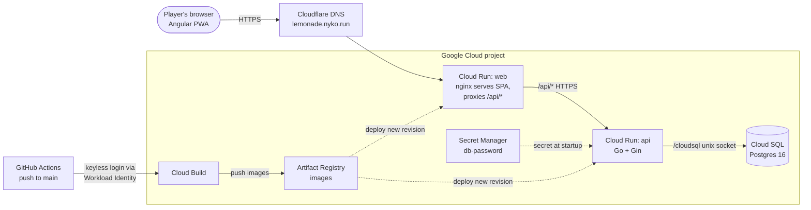

# Technical Design: Lemonade Tycoon

Turn-based lemonade business game. One loop: a **day**. Score = capital. Angular frontend, Gin (Go) backend, PostgreSQL. Username-only play with optional Google sign-in (Firebase Auth) to secure an account, installable PWA.

Sources: `docs/claude/` (SPEC, DESIGN, PLAN, DECISIONS, UX-MOCKS). Where they conflict, DECISIONS and the UX addendum win.

## Contents

1. [Scope](#1-scope)
2. [Architecture](#2-architecture) (system design, cloud deployment)
3. [Game rules](#3-game-rules) (resources and prices, facilities, end of day, events)
4. [Data model](#4-data-model)
5. [API](#5-api)
6. [Frontend and PWA](#6-frontend-and-pwa)
7. [Testing](#7-testing)
8. [Key trade-offs and limits](#8-key-trade-offs-and-limits)
9. [Balance and tuning](#9-balance-and-tuning)
- [Appendix: UX mocks](#appendix-ux-mocks)

## 1. Scope

**In**
- Username login (Google optional, to secure it), buy/sell of five resources at market bid/ask, expanding and upgrading two facility types
- End day with a report, bankruptcy, seeded price walk plus random events
- PWA shell (no offline play)
- README that installs, runs, and tests from a fresh clone (with the tuning knobs)

**Out (future work):** mixed tiers, demand simulation, price impact from player trades, event forecasting, loans, other sign-in providers, account deletion, leaderboard, e2e tests.

## 2. Architecture

### System design

- **Server is the source of truth.** The UI renders server state and never computes outcomes; every mutation returns the full game view.
- **Layers** (dependencies point inward):
  - `internal/domain`: pure game rules. No I/O, Gin, or SQL.
  - `internal/api`: thin Gin handlers, DTOs, error mapping, auth middleware (`internal/auth` verifies Firebase ID tokens).
  - `internal/store`: `Repository` interface, Postgres/GORM implementation, in-memory fake.
  - `main.go` stays at the module root because the Dockerfile and deploy scripts build it.
- **Determinism:** `rand.New(rand.NewSource(seed ^ int64(day)))` inside `EndDay`; no clock in the domain. The seed comes from the clock at game creation (API layer), so the same seed and actions give the same game.
- **Concurrency:** every mutation is `load → domain call → save` in one transaction with `SELECT ... FOR UPDATE` (proven by a 20-goroutine test).

### Cloud deployment

Google Cloud, Terraform in `deploy/infra/`; details in [deploy/README.md](../deploy/README.md)):



The browser only ever talks to `web`; its nginx forwards `/api/*` to `api`, so there is no CORS. Locally, `docker-compose.yml` runs the same three pieces (`web`, `api`, a `postgres:16` container) with `DB_HOST=db` instead of the Cloud SQL socket.

## 3. Game rules

All money is a whole-dollar `int`; one unit = one "case".

### Resources and prices

- **Resources:** lemon, sugar, ice, cup (inputs); lemonade (product). Recipe: 1 of each input → 1 lemonade.
- **Start:** $1,000, empty stock, everything at level 1.
- **Base prices:** lemon $20, sugar/ice/cup $10, lemonade $90.
- **Walk (float):** `p' = p + 0.15(base−p) + p·0.12·N(0,1)`, clamped to [0.25×, 4×] base.
- **Effective price:** `max(1, round(walked × Π active event multipliers))`. Events never change the walk.
- **Ask** = `ceil(price×1.1)`. **Bid** = `max(1, floor(price×0.9))`. Both are computed on float-snapped values (`100×1.1` must give 110, not 111).
- Selling has unlimited depth at the bid, including raw inputs. Buy and sell fail atomically: no partial fills.

### Facilities

Two types, one **shared level (1–4) per type**.
- **Warehouse:** one per resource, each with its own building count (max 10). Holds only its own resource; capacity = `count × size`.
- **Production:** one count (max 10); output per day = `count × rate`.

Costs, sizes and upkeep are per building.

| Warehouse | L1 Pantry | L2 Garage | L3 Barn | L4 Industrial Warehouse |
|---|---|---|---|---|
| Size (cases) | 10 | 25 | 60 | 150 |
| Build | $100 | $220 | $450 | $900 |
| Upgrade to next | $155 | $200 | $400 | n/a |
| Upkeep per day | $2 | $4 | $8 | $15 |
| Market depth (cases at plain price) | 80 | 280 | 480 | 960 |

| Production | L1 Kitchen | L2 Food Truck | L3 Bottling Plant | L4 Lemonade Factory |
|---|---|---|---|---|
| Rate (lemonade/day) | 10 | 25 | 60 | 150 |
| Build | $500 | $1,100 | $2,200 | $4,500 |
| Upgrade to next | $780 | $1,000 | $2,000 | n/a |
| Upkeep per day | $20 | $40 | $75 | $150 |

- **Expand** adds one building at the current level (for a warehouse, the player picks the resource).
- **Upgrade** raises the whole type one level for `per-building cost × total buildings of the type` (fresh game: 5 Pantries → Garages = $775).
- Costs, sizes, upkeep, and event data live in one `Config` struct.

### End of day

One atomic step, run as twelve named functions in a fixed order (`endday.go`; the late game tracks fill in the empty ones):

1. Managers act (empty until late game Upgrades B).
2. Produce the main recipe: `min(rate, stock of each input ÷ its quantity, free output space)` batches.
3. Freezer rotation (empty until Upgrades A).
4. Commodities with shelf life "melts nightly" (ice) go to 0; perishables spoil (Products B).
5. Pay upkeep `Σ buildings × upkeep(level)` (start: $30/day). Upkeep is always owed: a cash shortfall is covered by selling stock at bid (lemonade, lemon, sugar, cup, ice). If that still can't cover it, pay what's left and the game is over.
6. Record the day on the timeline, then the bankruptcy check.
7. Day + 1, the market forgets part of the player's recent trading.
8. Events expire then may spawn (economic cycles follow, Empire B).
9. Every commodity's price walks, in catalog order.
10. Rivals tick (Empire A). 11. Contract deadlines (Products C). 12. Price log.

Events come before the walk because they share one random stream (`SaltMarket` in `salts.go`); each later random system gets its own salt, so adding one never changes an existing seed's prices.

Bankruptcy is only checked here, so spending to $0 mid-day is legal. After game over every action is rejected until "New game" (replaces the row).

### Events

25% chance per day; table-driven, so adding one is one row.

| Event | Effect | Days |
|---|---|---|
| Heat Wave | lemonade ×1.4, ice ×1.3 | 2 |
| Rainy Week | lemonade ×0.75 | 3 |
| Lemon Blight | lemon ×1.7 | 3 |
| Sugar Glut | sugar ×0.7 | 2 |
| Holiday | lemonade ×1.35 | 1 |
| Cup Shortage | cup ×1.5 | 2 |

Multipliers stack. Events are visible the day they start, an active event never re-spawns, and events that push the same resource's price in opposite directions never overlap (Heat Wave ↔ Rainy Week, Holiday ↔ Rainy Week). This is derived from the multipliers, so a new row in the table is checked automatically; `Excludes` can still add an explicit pair.

## 4. Data model

Two tables. Scalars a leaderboard would query are real columns; state that is only loaded and saved with the game is JSONB. Tier names are derived from type + level, never stored. There is one game row per user (no history of past games).

**`users`**

| Column | Type | Notes |
|---|---|---|
| `id` | uint | primary key |
| `username` | text | unique, not null; the only public identity |
| `created_at` | timestamp | |
| `firebase_uid` | text | nullable, unique index (many NULLs allowed): NULL for a legacy account until claimed |
| `email` | text | nullable, private: stored, never in any DTO |
| `claimed_at` | timestamp | nullable: when a legacy account was linked |

**`games`**

| Column | Type | Notes |
|---|---|---|
| `id` | uint | primary key |
| `user_id` | uint | unique, not null (one game per user) |
| `seed` | int64 | RNG seed for the price walk and events |
| `day` | int | current day |
| `capital` | int | whole dollars |
| `status` | text | `active`, `bankrupt` or `gave_up` |
| `run_id` | text | UUID of this playthrough; empty on older rows, assigned on their first mutation |
| `warehouse_level` | int | 1–4, shared by all warehouses |
| `production_level` | int | 1–4 |
| `production_qty` | int | production buildings, 1–10 |
| `warehouse_qty` | JSONB | buildings per commodity, keyed by catalog key |
| `price_log` | JSONB | one point per day: effective prices per commodity (object; older rows hold a 5-element array) after the market tick, and the active event keys; NULL on older rows, seeded on load |
| `buy_pressure` / `sell_pressure` | JSONB | cases the player recently bought and sold per resource (market depth); NULL on older rows, treated as zero |
| `cost_basis` | JSONB | total dollars paid for the stock of each resource; NULL on older rows, seeded on load |
| `inventory` | JSONB | cases per resource |
| `market` | JSONB | per resource: walked price (float), previous effective price, history (≤ 14 days) |
| `events` | JSONB | active events with days remaining |
| `timeline` | JSONB | capital and stock snapshot after each action, for the history charts (old days compacted). Stock is an object keyed by commodity with zeros left out; rows saved before the catalog hold a 5-element array (lemon, sugar, ice, cup, lemonade), still read |
| `stats` | JSONB | running totals for the game-over summary |
| `updated_at` | timestamp | |

**Content catalog.** The commodities (key, name, category, storage class, base price, shelf life, input or product, display order) and the recipes (output, output quantity, ordered inputs) are data in `internal/domain/content/`, read into `Config.Commodities` and `Config.Recipes`. The game view carries the catalog as `commodities`, and every per-commodity array in the view (timeline stock, price log prices, base prices) follows its order.

Two more tables hold what must outlive a game row. `day_reports(run_id, day, payload JSONB)`, primary key `(run_id, day)`, has one row per ended day and is never loaded with the game. `runs(id, user_id, run_id unique, difficulty default 3, days, score, net_worth, capital, ended_by, timeline, stats, price_log, created_at)` has one row per finished run, indexed on `(difficulty, score desc)` and `(user_id, created_at desc)`. Both are written in the same transaction as the game change that produced them.

## 5. API

JSON, camelCase. The contract is `lemonade-web/src/app/core/api.models.ts`.

- Two ways to identify the caller on game, score and run routes. **Guest:** `X-Username`, accepted only for accounts with no Firebase UID (unknown or missing → 401 `unauthorized`; a secured account → 401 `account_secured`, and the UI forgets the name and points at Google sign-in). **Google:** `Authorization: Bearer <Firebase ID token>`; the API verifies signature, issuer, audience and expiry (Admin SDK, no per-request network call), requires provider `google.com` and a verified email, and maps the UID to a user. A request with an Authorization header is judged by the token alone. Invalid → 401 `unauthorized` (the UI refreshes the token once, then signs out); valid token with no player → 403 `profile_required` (the UI goes to onboarding). Google is off when `FIREBASE_PROJECT_ID` is unset.
- Errors: `{"error": "<code>", "message": "..."}`. Status 400 for `invalid_*` codes; 409 for `run_active`, `insufficient_funds`, `insufficient_stock`, `capacity_exceeded`, `max_level`, `max_quantity`, `game_over`.

| Route | Purpose |
|---|---|
| `GET /api/me` | the caller's `{id, username}`, or 403 `profile_required` |
| `POST /api/me/username {username}` | create the player and their first game (3–40 ASCII chars, case-insensitive); 409 `username_taken`, `already_linked` |
| `POST /api/me/claim {username}` | secure an existing username by linking the caller's Google account (also how a guest secures theirs) (conditional update, so two racing claims cannot both win); 404 `unknown_username`, 409 `already_claimed`, `already_linked`, 429 `rate_limited` (5 per 10 minutes per UID, in memory) |
| `POST /api/login {username}` | guest login: create-or-get user (+ new game); 409 `account_secured` if the name is secured with Google |
| `GET /api/game` · `POST /api/game/new` | view · fresh game |
| `POST /api/game/buy \| sell {resource, qty, clamp?}` | trade at ask · bid; with `clamp`, trades as many as cash, space or stock allow (up to `qty`) instead of failing |
| `POST /api/game/facilities/warehouse/expand {resource}` · `.../production/expand` | add one building |
| `POST /api/game/facilities/{warehouse\|production}/upgrade` | upgrade whole type |
| `GET /api/game/reports[?runId=]` · `GET /api/game/reports/{day}[?runId=]` | ended days of the current run (or of a finished run of the same player): a light list, or one full report; another player's run is a 404 |
| `GET /api/scores[?limit=]` | global board: one row per player (their best finished run), best first, an earlier finish wins a tie; `limit` 1 to 100 (default 20), 400 `invalid_limit` if not a number. Also returns `me`, the caller's own row and rank even below the rows shown |
| `GET /api/runs` · `GET /api/runs/{runId}` | the caller's finished runs, newest first with the best flagged; one run in full (score, stats, timeline, price log, report index). Another player's run, an unfinished run and an unknown one are all a 404 |
| `GET /api/game/quote?resource=&side=buy\|sell&qty=[&clamp=true]` | prices a trade with price impact without making it: total, average price, slippage; 400 for a bad resource, side or quantity |
| `POST /api/game/new` | start a fresh run; 409 `run_active` unless the last one is over (bankrupt or given up) |
| `POST /api/game/give-up` | end the run (`status: gave_up`) and record it; the score is the net worth at that moment |
| `POST /api/game/facilities/warehouse/sell {resource}` · `.../production/sell` | sell one building back at `ResaleRate` of its build cost; 409 `min_facility` or `stock_exceeds_capacity` |
| `POST /api/game/end-day` | `{report, game}` |
| `GET /api/health` | liveness only (Cloud Run reserves `/healthz`) |

The view is display-ready (tier names, bid/ask, capacities, costs, `upgrade: null` at max level), so the client never recomputes rules.

## 6. Frontend and PWA

- Angular 17 standalone components and signals. Only `GameStore` calls `ApiService`; components are presentational.
- Failed actions show the server message and keep the view. End day is disabled while a request is in flight.
- **PWA:** manifest, icons, and a service worker (production builds only) that prefetches the shell with **no data group for `/api/**`**. `online.service` drives an offline banner and disables all actions offline.
- Installability is verified with Chrome's `getInstallabilityErrors` (Lighthouse 12 dropped its PWA audit). nginx serves the manifest as `application/manifest+json` with `no-cache`.

## 7. Testing

| Layer | Coverage |
|---|---|
| Domain | Table-driven tests per rule: buy/sell limits, capacity, rounding across $1–$500, expand/upgrade cost scaling, production `min()`, melt, upkeep, bankruptcy truth table, clamp over 1,000 days, event stacking/expiry/exclusion, determinism |
| API | Handler tests on the in-memory repo: status codes, error shape, contract fields |
| Store | Repository contract test on the in-memory fake |
| Frontend | Store, component, and offline tests |

`go test ./...` and `ng test` must pass before each slice is ticked.

## 8. Key trade-offs and limits

| Choice | Buys | Costs |
|---|---|---|
| Pure domain | Fast, deterministic tests | A DTO mapping step |
| JSONB for game internals | No join tables | No SQL analytics |
| Seed-derived RNG | No generator state stored | |
| Bid/ask spread | Blocks same-day arbitrage | |
| Whole dollars | No cents handling | Bulk-sized prices |
| Shared level per type | Simple upgrades | No Barn-for-lemons; upgrade cost grows with expansion |
| Liquidation grace | A player can't sit at $0 holding stock | Harsher than "any inventory survives" |
| Optional Google sign-in (Firebase) | Guests start with just a name; Google secures an account without passwords to store | Guest names are open to anyone until secured; securing is first come, first served |
| PWA shell only | No stale-state bugs | No offline play |

Open question: the brief mentioned three facility types but named two. They are modeled as two; a third is another type with its own level and tiers.

## 9. Balance and tuning
Every balance number lives in one struct, `DefaultConfig()` in `lemonade-api/internal/domain/config.go`: prices, spread, volatility, events, tier sizes, costs, upkeep. Change a value and restart the API (`docker compose up -d --build api`); the frontend shows whatever the API sends. §3 lists the current values; these are the economy-wide knobs:

| Knob | Value | What it does |
| ---- | ----- | ------------ |
| `StartingCapital` | $1,000 | Cash in a new game |
| `BasePrice` | lemon $20, sugar $10, ice $10, cup $10, **lemonade $90** | Each resource's long-run price per case |
| `Spread` | 10% | You buy at the *ask* (price +10%, rounded up) and sell at the *bid* (price −10%, rounded down, at least $1), so buying and selling straight back loses about 18% |
| `Sigma` | 0.12 | Daily price volatility: each day the price moves by about ±12% |
| `RevertRate` | 0.15 | How strongly prices are pulled back toward their base (15% of the gap per day) |
| `ClampMin` / `ClampMax` | 0.25× / 4× | Hard floor and ceiling on the walked price |
| `EventChance` | 25% | Chance per day that a new market event starts |
| `FreeDepth` | 80 cases per resource | How many cases you can buy (or sell) at the plain price at warehouse level 1 before the market reacts to your own trading |
| `DepthByLevel` | 1, 3.5, 6, 12 | Multiplies `FreeDepth` by warehouse level: 80, 280, 480 and 960 cases. A bigger business reaches more customers (interim, until territories) |
| `ImpactShape` | 0.24 | Each case beyond the free depth moves the price by this times its share of the depth (0.3% a case at a depth of 80, 0.086% at 280): the ask up when you buy, the bid down when you sell |
| `Recovery` | 50% | Share of your remembered trading volume the market forgets each night |
| `ImpactCap` | 60% | Most a price can move because of your own trades |
| `ResaleRate` | 50% | Share of a building's build cost returned when it is sold (quantity only; levels are never sold) |
| `MaxLevel` / `MaxQuantity` | 4 / 10 | Highest facility level, and most buildings per warehouse resource (and for production) |
| `HistoryLength` | 14 | Days of price history kept per resource |

Prices are seeded by the game's seed and day number, so a game is fully reproducible. Quotes are whole dollars, at least $1.

**Unit economics.** One lemonade needs one case each of lemon, sugar, ice and cup. That costs about $55 at the ask and sells for about $81 at the bid, so a lemonade earns **about $22 (+40%)**, but the margin swings from a $7 loss (5th percentile) to a $59 profit (95th). Producing loses money on roughly 1 day in 9.

A new game has 5 Pantries and 1 Kitchen: **$30 a day** in upkeep against about $220 a day of gross profit on average. To grow, production and *all* the warehouses must grow together, and each step also raises upkeep, so over-expanding is the way to go under.

**Why these numbers.** Tuned by simulation, not by feel: simulated players (a careful one, a sloppy one that sometimes forgets the ice or spends its cushion, a careless random one, and an idle one) play hundreds of seeded games. The outcome under the defaults:

| Player | Result |
| ------ | ------ |
| Careful, keeps reinvesting | Fills level 1 by about day 28, reaches level 4 by about day 65; about 1 in 8 still go bankrupt within 90 days |
| Sloppy (forgets ice 8% of days, overspends 6%) | About 2 in 3 go bankrupt within 45 days |
| Careless (random actions) | All go bankrupt, typically by day 10 |
| Idle (does nothing) | Bankrupt around day 34 |

Two earlier problems drove the last tuning pass: the market was almost riskless (producing was unprofitable on only 1.4% of days) and a player holding *any* stock could never lose. Lemonade is now $90 (was $100), prices are more volatile, upkeep is doubled, and unpaid upkeep is no longer forgiven.

**Exploit baseline (balance handoff, phase 0).** Before any change to the market, bots that play it hard were measured over 200 seeded games each, with the real domain calls (`exploitbots_test.go`; print with `BALANCE_REPORT=1 go test ./internal/domain -run TestBalanceReport -v`). Capital medians count games still running at that day.

| Bot | What it does | Bankrupt | Day 60 | Day 90 | Everything maxed |
| --- | ------------ | -------- | ------ | ------ | ---------------- |
| Careful grower (existing) | steady batches, reinvests with a cash cushion | 13% | $29.9k | $308k | day 66 (87% within 120 days) |
| **Spammer** | never looks at prices: sell all, buy a full batch, expand as soon as affordable | 20% | **$34.6k** | **$388k** | day 59 (82%) |
| Opportunist (= hoarder) | produces whenever the margin is positive, stocks up at dips, sells at once | 38% | $34.8k | $329k | day 65 (69%) |
| Thresholder | as above, but skips days with a margin under $10 and holds lemonade for a good bid | 64% | $19.2k | $229k | day 68 (47%) |
| Thresholder, literal rule (ask at most 0.9 x base only) | never buys at any other time | 100% | dead | dead | never |

Findings: (1) The exploit is real and needs no skill: the price-blind spammer out-earns the careful grower ($34.6k against $29.9k at day 60, $388k against $308k at day 90) and 80% of spammers survive 120 days. Only 23% of spammers are bankrupt or under $1,000 at day 90. (2) Waiting for good prices does not pay: upkeep is due every day whether or not anything is produced, so skipping days makes the thresholders die more (64% against 20%). The "free option" in the diagnosis is much weaker than volume. (3) Lemonade cannot be hoarded: a warehouse holds exactly one day of production at every level (10/20/40/80 each), so the hoarder sells daily and matches the opportunist. (4) The handoff's literal buy rule (ask at most 0.9 x base) needs the price about 18% under base in lemon, sugar and cups at the same time and starves the bot.

**Market depth (balance handoff, phase 1).** The market now reacts to the player's own trading, which is what stops the price-blind volume strategy. Each resource remembers how many cases the player recently bought and sold, separately (so buying only raises the ask and selling only lowers the bid, and no buy-then-sell round trip can profit). The k-th case traded costs the plain ask (or pays the plain bid) until the free depth is used up, then moves the price by 0.24 times the case's share of the free depth per further case (0.3% a case at level 1) up to a 60% cap; half of the remembered volume is forgotten each night. Costs are summed per case in whole dollars. The game view's `bid` and `ask` are the price of the next single case, each row says how much free depth is left and how far the price has moved, and a per-amount ladder (1, 10, 50, 100, all) gives the server's total for the trade bar, so the UI does no price arithmetic. Net worth and the score still value stock at the plain bid and ignore price impact.

Knobs were chosen by sweeping free depth (40 to 200), slope (0.2% to 1.5%) and recovery (30% or 50%) against the bots. The handoff's first guess (40 free cases, 1.5% per case) made every bot go bankrupt, including the careful one. After: a careful player and the skilled traders run at about $9-10k at day 60 and $15k at day 90 (before: $30k and $308k), 20% bankrupt over 120 days, and the price-blind spammer is bankrupt in 100% of games (before: 20%, and it was the richest bot). Careful and skilled bots now size each batch to the last case that still earns money and only add capacity when capacity is what limits profit, as a real careful player would. Early game is untouched: a level 1 or 2 business stays inside 80 free cases. Still unmet: nobody now reaches "everything maxed" (before: median day 66), and the best play flattens out around $15k.

**Late game phase 0 (scale economics).** With the flat depth of pass 1 a careful player stalled near $15k: the market absorbed about 54 cases a day at any size, upgrades made each case dearer, and a maxed business paid $4,800 a day in upkeep. Three changes fix it. (1) The free depth grows with warehouse level (`DepthByLevel`). (2) The impact is relative to the depth (`ImpactShape`), so heavy trading feels the same at every size, and level 1 is byte-for-byte the old 0.3% a case (tested). (3) Tiers get cheaper per case as they grow (upkeep per case of production: $2.00, $1.60, $1.25, $1.00), and the L1 to L2 upgrade costs about 0.7 times the next tier's build cost while later upgrades cost about 0.45 times.

| Careful grower, 200 seeds, 120 days | Pass 1 | This phase | Target |
|---|---|---|---|
| Bankrupt | 21% | 9% | 13% or less |
| Median capital, day 5 / 10 / 15 / 20 | $980 / $1,010 / $1,210 / $1,520 | identical | within 10% |
| Day 60 | $10.5k | $17.3k | at least $15k |
| Day 90 | $14.6k | $50.8k | at least $40k |
| Gain day 60 to 90 over day 30 to 60 | 0.6x | 2.5x | at least 1.5x |
| L3 median day | never | 75 | 90 or earlier |
| Everything maxed | never | day 93, 64% within 120 days | at least 50%, median day 90 or later |
| Spammer bankrupt or under $1,000 at day 90 | 100% | 99% | at least 25% |
| Spammer beats a skilled bot at day 60 | 0% | 0% | never |

Skilled trading bots land near the grower (thresholder day 90 $52.7k, opportunist $66.0k, both 5% or less bankrupt, maxing by day 86 to 91 in 67% to 77% of seeds).

`TestEachLevelPaysMoreThanTheLast` is the permanent guard: a steady-state model prices every case of a day at the pressure left by the day before (recovery 50%) and asserts that, with ten buildings, the best net profit a day strictly rises from L1 to L4 (about $1.0k, $3.6k, $6.4k and $13.0k a day at base prices, best volumes 50, 175, 300 and 600 cases).

**Tuning it yourself.**

| To make the game… | Change |
| ----------------- | ------ |
| easier | raise `StartingCapital`, lower the `Upkeep` values, lower `Sigma`, raise `BasePrice[Lemonade]` |
| harder | the opposite, or raise `EventChance` |
| faster to progress | lower `BuildCost` and `UpgradeCost` |
| slower to progress | raise them |

Guard-rail tests (`TestBalance*` in [balance_test.go](../lemonade-api/internal/domain/balance_test.go)) fail if a change makes the game too easy, too harsh, riskless or stalled. Commands to run them and print the full report are in the README ("Tuning the game").

Changing a price, cost or upkeep also changes a few exact numbers asserted in the API and domain tests (for example the $500 first warehouse upgrade); update those alongside.

---

# Appendix: UX mocks

Copy is sentence case, no emoji, one icon set, **one primary button per screen**. Routes: `/` Home, `/signin`, `/game` (also shows game over when `status = bankrupt`; redirects to `/signin` when signed out). "Log out" signs out of Firebase (its session lives in IndexedDB; the app stores no token). `/signin/username` is onboarding for a signed-in account with no player.

**Nav (every page)**
```
Signed out: | [logo] Lemonade Tycoon                                   [ Sign in ]   |
Signed in:  | [logo] Lemonade Tycoon                       (user) lemonjoe [Log out] |
```

**Home** (signed in: "Play game" reads "Continue game" → `/game`)
```
|                             [lemon icon]                               |
|                          Lemonade Tycoon                               |
|      Buy low, sell high, and grow your stand into a factory.           |
|                   [ Play game (primary) ]  [ Sign in ]                 |
```

**Sign in** (username form is primary; Google is the quieter option, hidden when Firebase is not configured)
```
|                    Username                                            |
|                    [ lemonjoe                    ]                     |
|                    [ Continue (primary)          ]                     |
|                    New name? We'll start a game for it.                |
|                    Protected your username with Google?                |
|                    [ Sign in with Google ]                             |
```

**Secure your account** (`/secure`, guests only; the nav shows "Secure account" to a guest and a "Secured" badge once linked)
```
|                    Right now anyone who types lemonjoe can play as you.|
|                    [ Link Google account (primary) ]   Not now        |
```

**Choose a username** (`/signin/username`, for a new Google account; "I already have a username" links an existing one)
```
|                    Choose a username                                   |
|                    [ lemonjoe                    ]                     |
|                    [ Start playing (primary)    ]                     |
|                    I already have a username                           |
```

**Game page**
```
| Day         Capital        Upkeep per day                              |
| 4           $1,240         $30                        [ End day -> ]   |
+------------------------------------------------------------------------+
| (sun) Heat wave: lemonade x1.4 and ice x1.3 for 2 more days            |  events banner
+------------------------------------------------------------------------+
| Market and inventory                                                   |
| Resource  Stock         Price        Buy at ask       Sell at bid      |
| Lemon     [####------]  $20 ^ ~~~    [1] [Buy $22]    [1] [Sell $18]   |
|           4 / 10                                                       |
| Lemonade  [##########]  $140 ^ ~~~   [1] [Buy $154]   [1] [Sell $126]  |
|           10 / 10            (sugar, ice, cups rows follow the same)   |
+------------------------------------------------------------------------+
| Facilities                                                             |
| +---------------------------------------------+ +--------------------+ |
| | [img] Pantry                                | | [img] Kitchen      | |
| |       Warehouses, level 1 of 4              | |       Production,  | |
| |       Upkeep $10 per day                    | |       level 1 of 4 | |
| | [ Upgrade all warehouses to Garage: $500 ]  | | 1 building         | |
| | Covers 5 buildings at $100 each. Each       | | Makes 10 lemonade  | |
| | building goes from 10 to 20 cases.          | | per day            | |
| |---------------------------------------------| | Upkeep $20 per day | |
| | Lemon     x1  Holds 10 cases  [Expand $100] | | [ Expand: $500 ]   | |
| | Sugar / Ice / Cups / Lemonade rows the same | | [ Upgrade to Food  | |
| +---------------------------------------------+ |   Truck: $1,000 ]  | |
+------------------------------------------------------------------------+
```
Only "End day" is primary. Stock bar = stock / (`count × size`). Price cell = effective price, trend arrow vs. yesterday, 14-day sparkline (stretch). Buy shows the ask and Sell the bid. One Upgrade button covers a whole type and reads "Max level" at level 4; Expand is per warehouse resource, and Production has its own. Buy/Sell/Expand/Upgrade stay enabled and show the server error (except offline).

**Day report** (modal; built from the end-day `DayReport`; dismiss returns to the game)
```
| Day 4 report                       |
| Lemonade produced        +10       |
| Ice melted               2 cases   |
| Upkeep paid              -$30      |
| Lemonade price           $100 -> $140
| New event                Heat wave |
| Capital           $1,240 -> $1,210 |
| [ Start day 5 (primary) ]          |
```
Shows a warning when capital ends at $0 but the game continues.

**Game over** (`New game` → `POST /api/game/new`)
```
|                          [sad face icon]                               |
|                       Bankrupt on day 12                               |
|         You ran out of cash and stock. Final capital: $0.              |
|                       [ New game (primary) ]                           |
```

**Component map:** `nav-bar` (sign in/out) · `stats-strip` (day, capital, upkeep, end-of-day projection; end day) · `events-banner` · `market-panel` (shared trade amount: 10/50/100/All, then Buy and Sell per row) · `facilities-panel` (expandWarehouse, expandProduction, upgrade, sell with confirmation) · `day-report-modal` (body shared with `past-days-drawer`) · `game-over` · `offline-banner`. Open UX: signed-in users are not auto-redirected from `/`; mobile stacks each market row as a card.
